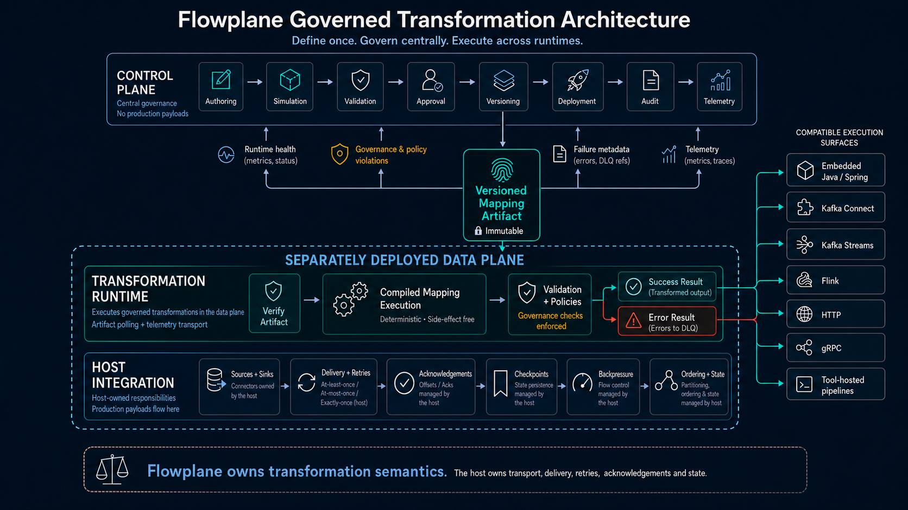

# Flowplane architecture

Flowplane separates governed transformation semantics from the systems that transport and deliver records.

**Flowplane owns transformation semantics. The host runtime owns transport, delivery, retries, acknowledgements, checkpoints, ordering, backpressure, and state.**



The diagram shows the full operating boundary: a control plane governs immutable mapping artifacts; a separately deployed transformation runtime verifies and executes them; and the host integration retains responsibility for production payload movement and delivery guarantees.

## Three execution layers

### Control plane

The control plane manages the mapping lifecycle rather than processing the production data stream.

- authoring and simulation;
- schema and mapping validation;
- approval and governance policy;
- immutable versioning;
- deployment assignment and rollout coordination;
- audit history; and
- bounded telemetry ingestion and operator views.

Its primary outbound object is a versioned mapping artifact. Its normal inbound signals are runtime health, deployment state, bounded metrics, and failure metadata—not production payloads.

### Transformation runtime

The transformation runtime is the deterministic execution boundary.

1. It retrieves the assigned artifact.
2. It verifies artifact identity and integrity.
3. It executes the compiled mapping.
4. It applies field validation and transformation policies.
5. It returns a canonical success or error result.

The runtime does not own connectors, broker acknowledgement, orchestration, checkpoint storage, or host retry behavior. Those responsibilities remain outside the transformation engine.

### Host integration

The host integration connects Flowplane execution to the surrounding data system. Depending on the deployment, that host can be an embedded Java application, Kafka Connect, Kafka Streams, Flink, an HTTP or gRPC sidecar client, a serverless wrapper, or a tool-hosted pipeline.

The host owns:

- sources and sinks;
- delivery and retry policy;
- acknowledgements and offsets;
- checkpoints and state;
- backpressure and flow control;
- partitioning and ordering; and
- publication of transformed or DLQ records.

## Data and control flows

### Artifact flow

```text
Control plane → immutable versioned artifact → assigned transformation runtime
```

Artifact identity follows the deployment so operators can inspect which mapping version and hash a runtime loaded.

### Production payload flow

```text
Source → host integration → transformation runtime → success/error result → host-owned sink or DLQ
```

Production payloads remain inside the separately deployed data-plane boundary unless an operator explicitly enables a documented retention or replay path.

### Operational feedback

```text
Runtime health + bounded metrics + deployment state + failure metadata → control plane
```

This feedback supports drift detection, rollout visibility, audit, and rollback without requiring the control plane to become the payload transport.

## Execution surfaces

The architecture supports several integration styles while preserving the same artifact and result contract:

| Style | Examples |
|---|---|
| Native | Embedded Java/Spring, Kafka Connect, Kafka Streams, Flink |
| Protocol | HTTP single, HTTP batch, gRPC batch, gRPC streaming |
| Tool-hosted | Pulsar, NiFi, Spark, Camel, Redpanda Connect, Logstash, Beam, Vector, OpenTelemetry, Debezium, and broker-specific pipelines |
| Function wrappers | AWS Lambda, Azure Functions, Google Cloud Functions, and provider event handlers |

Exact tested boundaries and current qualification are maintained in [Runtime portability](runtime-portability.md) and the [integration evidence overview](../evidence/integration-proofs/EVIDENCE-OVERVIEW.md).

## Evidence plane

The evidence plane is not part of production record delivery. It preserves the material needed to inspect a claim:

- run manifests and environments;
- canonical output comparisons and hashes;
- intentional DLQ records and error contracts;
- runtime and artifact identity;
- broker or provider state;
- screenshots and sanitized logs;
- per-bundle and repository checksums; and
- reproduction and validation scripts.

See [How it works](how-it-works.md), [Failure handling](failure-handling.md), [Governance and security](governance-and-security.md), and [Scope and limitations](limitations.md) for the corresponding lifecycle, error, security, and evidence boundaries.
